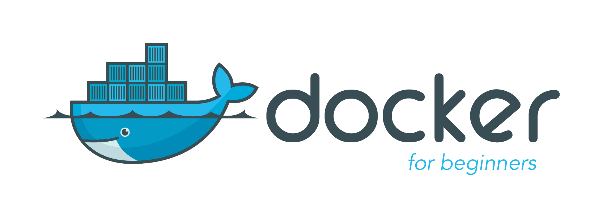
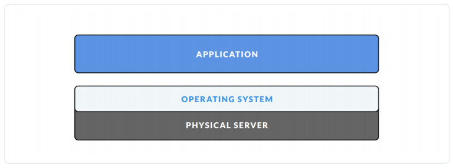
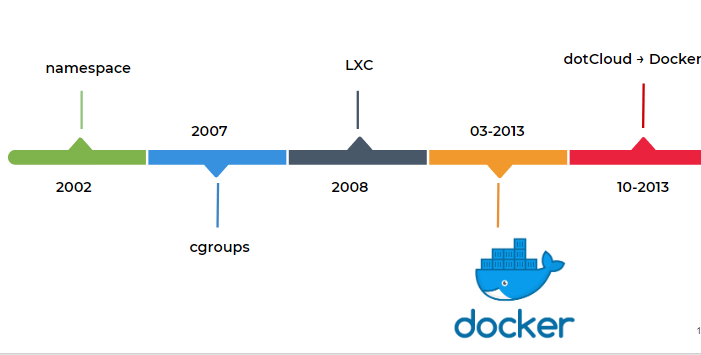

# Tổng quan về Docker

## 1. Docker là gì?

Docker là một nền tảng mã nguồn mở để cung cấp cách để `building`, `deploying` và `running` ứng dụng một cách dễ dàng trên nền tảng ảo hóa. Hiện này, có nhiều công nghệ Container khác như BSD jails, và LXC...

Hiểu một cách mộc mạc thì docker đóng gói và cài đặt môi trường cho chương trình nhanh chóng, rút gọn các bước cài đặt. Ví dụ như khi tôi muốn triển khai zabbix server thủa ban đầu tôi cài tay từng dòng lệnh, dần dần tôi scripts hóa để rút gọn thời gian triển khai, còn đối với docker container bạn chỉ cần chạy một câu lệnh duy nhất để có thể cài đặt thành công zabbix server.

Hiểu một cách thuần hơn nữa `container` như một cái thùng, một khoang chứa mà ở đó gom tất cả các thứ cần thiết để chạy cho ứng dụng của bạn, không bị các yếu tố khác gây ảnh hưởng và cũng không ảnh hưởng tới thành phần còn lại của hệ thống.

Các tiến trình (process) trong một container bị cô lập với các tiến trình của các container khác trong cùng hệ thống tuy nhiên tất cả các container này đều chia sẻ kernel của host OS (dùng chung host OS).

## 2. Những ai thường sử dụng docker

Docker phù hợp cho nhiều đối tượng trong đó phù hợp nhất là dành cho Devs, Sysadmin. 

+ Devs cần triển khai môi trường thật nhanh để xây dựng ứng dụng của mình mà không cần hiểu quá sâu về các ứng dụng môi trường và mất thời gian cài đặt. 

+ Sysadmin có lẽ là sử dụng docker như một vũ khí lợi hại. Đối với những ứng dụng sysadmin đã am hiểu cài đặt triển khai lặp đi lặp lại thì sử dụng docker container thì quá là nhanh luôn. Đối với những ứng dụng mới sysadmin cần dựng nó lên và tìm hiểu xem chúng hoạt động thế nào từ đó vọc ngược lại, đây cũng là một cách khá hay.

## 3. Quá trình hình thành docker

Thời ban đầu ta thường thấy mô hình máy `chủ vật lý + hệ điều hành(OS) + ứng dụng` điều này cos nghĩa là hệ điều hành được cài thẳng lên server vật lý thông thường là cài một hệ điều hành và bắt đầu triển khai ứng dụng.

=> Nhược điểm là lãng phí tài nguyên, một máy chủ chỉ cài được một OS, cho dù có ổ cứng khủng, ram khủng thì cũng không tận dụng hết tài nguyên phần cứng.

Giai đoạn sau công nghệ ảo hóa `vitualization` xuất hiện phổ biến như VMware, Virtalbox...trên một máy chủ vật lý mình có thể tạo được nhiều OS, tận dụng tài nguyên đã tốt hơn.

=> Nhược điểm trong việc phân phát tài nguyên khi tạo một máy ảo ram 2GB trên máy thật ram 4GB, lúc này máy thật sẽ mất 2GB ram cho máy ảo, kể cả khi máy ảo không dùng hết 2GB ram, đó là một sự lãng phí.

Thời điểm này người ta sinh ra công nghệ `containerlization` trên một máy chủ vật lý tạo được nhiều máy con (giống với công nghệ ảo hóa vitualization),các máy con (Guess OS) đều dùng chung phần nhân (kernel) của máy mẹ (Host OS) và chia sẻ với nhau tài nguyên máy mẹ.

Có thể nói là khi nào cần tài nguyên thì được cấp, cần bao nhiêu thì cấp bấy nhiêu, như vậy việc tận dụng tài nguyên đã tối ưu hơn. Điểm nổi bật nhất của containerlization là nó sử dụng các container.

## 4. Lợi ích của docker

+ Linh động

+ Nhanh

+ Nhẹ

+ Đồng nhất

+ Đóng gói
