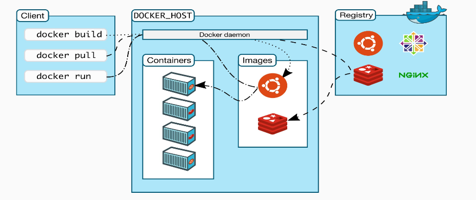

# Thành phần và sự hoạt động của docker

## 1. Các thành phần, kiến trúc trong docker

Docker client trao đổi với Docker daemon thông qua REST API

**Docker daemon** (dockerd) lắng nghe các yêu cầu từ Docker API và quản lý các đối tượng Docker như images, containers, network và volume. Một daemon cũng có thể giao tiếp với các daemon khác để quản lý các Docker services.

**Docker registries**: Các Docker image có thể được đăng ký lưu trữ một cách dẽ dàng qua Docker Hub và Docker Cloud để bạn có thể đẩy lên vào kéo về dễ dàng các images.

**Docker objects**: Khi sử dụng docker các đối tượng được tạo ra như images, containers, networks, volume, plugins và các đối tượn khác.

+ Image: Hay còn gọi là docker mirror, là các template read-only hướng dẫn cách tạo ra các Docker container. image được sử dụng để đóng gói ứng dụng và các thành phần phụ thuộc của ứng dụng. Image có thể được lưu trữ ở local hoặc trên một registry. 

Một sô cách để tạo ra image như: xây dựng từ đầu, tải từ một nguồn nào đó về.

+ Container: 1 container là 1 runable instance (thể hiện) của image, có thể create, run, stop, delete hoặc move container sử dụng Docker API hay CLI. Default thì một container được cách ly tương đối với các container và host. Có thể control được việc cách ly network, storage, hoặc các sub system khác nằm dưới các containers hoặc các host machine.

+ Service: Service cho phép bạn mở rộng các containers thông qua Docker daemons, chúng làm việc với nhau như 1 nhóm (swarm) với machine manager và workers. Mỗi một member của swarm là 1 daemon Docker giao tiếp với nhau bằng cách sử dụng Docker API. Theo mặc định thì service được cân bằng tải trên các nodes.

+ Network: Cung cấp một private network mà chỉ tồn tại giữa container và host.

+ Volume: volume được thiết kể để lưu trữ các dữ liệu độc lập với vòng đời của container, chia sẻ dữ liệu giữa host và container, container với container. Có 2 kiểu docker volume: `bind mount`, `data managed volume`.

## 2. Sự hoạt động của docker

