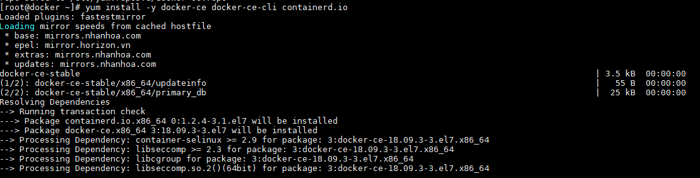

# Cài đặt Docker trên CentOS 7

## 1. Chuẩn bị

*Muốn sử dụng được Docker thì phải cài đặt docker. Docker cung cấp 2 phiên bản là:*

CE (Community Edition): phù hợp cho đối tượng là các developer hay những nhóm nhỏ muốn bắt đầu trải nghiệm Docker. Các bạn có thể làm theo các bước ở đây để cài đặt. Có hai phiên bản của Docker CE là `Edge` và `Stable`. Bản `Edge` sẽ được release hàng tháng với các tính năng mới nhất, còn Stable sẽ release theo quý.

EE (Enterprise Edition): là phiên bản Docker CE có chứng nhận đối với một vài hệ thống và được hỗ trợ bởi các doanh nghiệp lớn như IBM, Microsoft, ... mất phí và có bản dùng thử.

## 2. Cài đặt trên CentOS7

+ Cài đặt các package cần thiết

```
yum install -y yum-utils device-mapper-persistent-data lvm2
```


+ Thêm repo Docker

```
yum-config-manager --add-repo https://download.docker.com/linux/centos/docker-ce.repo
```


+ Cài đặt bản lastest của Docker CE

```
yum install -y docker-ce docker-ce-cli containerd.io
```



+ Kiểm tra cài đặt

```
systemctl start docker
systemctl enable docker
systemctl status docker
docker -v
```


Cài đặt node docker rất đơn giản.